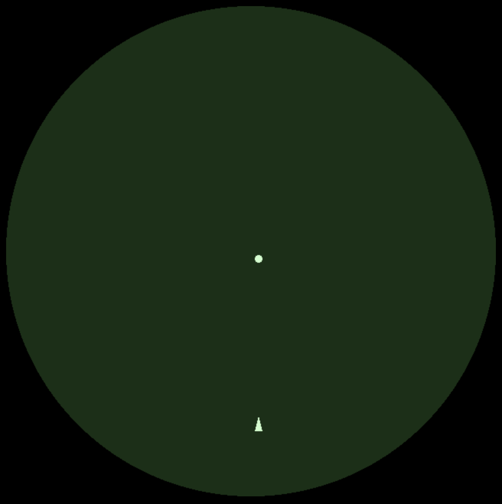

 
## The new game
Okay, after the wild success of the first game getting 3 plays in the first day (probably my parents), it's time to ride this high and create a new one. After opening up a new BabylonJS playground I wasn't really feeling it. So I think I'll make this next one with [PixiJS](https://pixijs.com). 

[From the PixiJS website](https://pixijs.io/guides/basics/what-pixijs-is.html): *"At its heart, PixiJS is a rendering system that uses WebGL (or optionally Canvas) to display images and other 2D visual content. It provides a full scene graph (a hierarchy of objects to render), and provides interaction support to enable handling click and touch events. It is a natural replacement for Flash in the modern HTML5 world, but provides better performance and pixel-level effects that go beyond what Flash could achieve. It is perfect for online games, educational content, interactive ads, data visualization... any web-based application where complex graphics are important. And coupled with technology such as Cordova and Electron, PixiJS apps can be distributed beyond the browser as mobile and desktop applications."* 
 
Since PixiJS is a 2D rendering engine, it's going to have to be 2D. From the examples on the PixiJS website I get the impression that this engine lends itself well to making stuff that just looks crisp. Like, look at this demo https://pixijs.io/examples/#/demos-advanced/mouse-trail.js it just feels right, you know?

 ## Spacewar!
When thinking of idea's I first though I'd make a platformer, inspired by one of my favorite games: Fancy Pants. However, it would take a lot of time to get something that would be as smooth as that. So my second idea was to do something inspired by [Spacewar!](https://en.wikipedia.org/wiki/Spacewar!), which is a circular space fighting game. It's also one of the or maybe even the first video game ever made. The wikipedia article is really worth a read if you're into video game history. 



I just think it's such a vibe. The exclamation point at the end of the name is just the cherry on top for me. Also, the fact that it has a circular screen is just very unique. It was the same kind they would use for radar. 

## What actually is 'Spacewar!'?

Here's a good description from the Wikipedia:

*The game features two spaceships, "the needle" and "the wedge", engaged in a dogfight while maneuvering in the gravity well of a star. Both ships are controlled by human players. Each ship has limited weaponry and fuel for maneuvering, and the ships remain in motion even when the player is not accelerating.*

This seems doable right? Here's my plan:
1. Create a circular canvas 
1. Add an object in the middle of this canvas (the star)
1. Add a spaceship object
1. Add controls to the ship
1. Add gravity to the start, and have this affect the spaceship

And after we've done that we'll see where to go from there. 

## Creating a circular canvas

First off, making a canvas at all. I used the code from the [getting started guide](https://pixijs.io/guides/basics/getting-started.html). However, I'm not using any server yet, I want to see how far I can get with just an HTML page. 
I've not found a way to make the canvas circular so I'm just going to make a square canvas and see if it can be partly transparent next.

First thing was making the background transparent. This wasn't necessarily hard, but there were a number of different answers out there that didn't work for me. This worked though:

    let app = new PIXI.Application({ width: 640, height: 640, backgroundAlpha: 0});

So, using that getting started guide, and the transparent background thing. I ended up with this to render my background:

    <!doctype html>
    <html>
    <head>
        
    </head>
    <body style="background-color:black;">
        
    </body>
    </html>

I added the brilliantly named 'wedge' ship first. Since it's just a triangle, I can also use the graphics to draw this. I then converted it to a Sprite, which is what you need it to be to move it later on.

    const wedgeGraphics  = new PIXI.Graphics();
    wedgeGraphics.beginFill(0xccffcc);
    wedgeGraphics.moveTo(320,210);
    wedgeGraphics.lineTo(310, 210);
    wedgeGraphics.lineTo(315, 190);
    wedgeGraphics.endFill();
    var texture = app.renderer.generateTexture(wedgeGraphics);
    var wedge = new PIXI.Sprite(texture);
    app.stage.addChild(wedge)

So far, I'm really enjoying the simplicity of this project. Behold the current fruits of my labor:

I know, these kinds of graphics just blow your mind right? Jokes aside, I gave it all a green tint to hopefully get that CRT vibe. Eventually I want to see if I can also replicate the previous images fading slowly like it would have on the original screen. But that's just for style points at the end. 

## Moving the wedge

Since PixiJS isn't an engine, it doesn't really include a lot of the stuff that I'm used to when making games. Input handling is one of them, apparently you can just use the 'normal' page key events for this though. For my project, I want to be able to move the wedge in a direction, and rotate it. 
I found [this amazing tutorial](https://github.com/kittykatattack/learningPixi#keyboard) that has something specifically for handling input. This is basically all you need if you want to use specific keys to make your sprite go into a specific direction. However, I wanted to have my wedge move into the direction it was pointing at. To my surprise, I found out from my frantic googling that this kind of thing is where you're just really on your own in this framework. I would have to do the math, and I honestly don't think I've ever had to do that before. I usually just count on the local coordinate system of whatever engine I'm using. 

Now, I could probably hack something together to give me this, maybe a container, rotate that, and use a coordinate system there? But since this is also supposed to be a learning opportunity for me (and I'm frankly embarrassed that I don't know this top of mind) I set out to implement this myself. It turned out to be honestly shockingly simple, all I needed to do was figure out the direction from the angle I'm setting the wedge at. I found this [math stackexchange answer](https://math.stackexchange.com/questions/180874/convert-angle-radians-to-a-heading-vector) and implemented it in what I had set up.

    app.ticker.add((delta) => {
        wedge.angle += wedge.VAngle;
        let direction ={x: Math.cos(wedge.rotation), y: Math.sin(wedge.rotation)};
        wedge.x += direction.x * wedge.vy;
        wedge.y += direction.y * wedge.vy;
    });

Weirdly, it seemed like the way I had originally drawn my wedge may have been in the wrong direction? For the above to work I had to change the drawing code to this:

    const wedgeGraphics  = new PIXI.Graphics();
    wedgeGraphics.beginFill(0xccffcc);
    wedgeGraphics.moveTo(0, 0);
    wedgeGraphics.lineTo(0, 10);
    wedgeGraphics.lineTo(-15, 5);
    wedgeGraphics.endFill();

All in all, this is what I've created thus far (I've taken out [the copied over keyboard function](https://github.com/kittykatattack/learningPixi#keyboard) to save some space):

    <!doctype html>
    <html>
    <head>
        
    </head>
    <body style="background-color:black;">
        
    </body>
    </html>

I'm so happy with this, look at it! It's beautiful. I've also the option to press the spacebar to reset the wedge position, since I ended up losing it off the canvas a few times. 

## Gravity 

