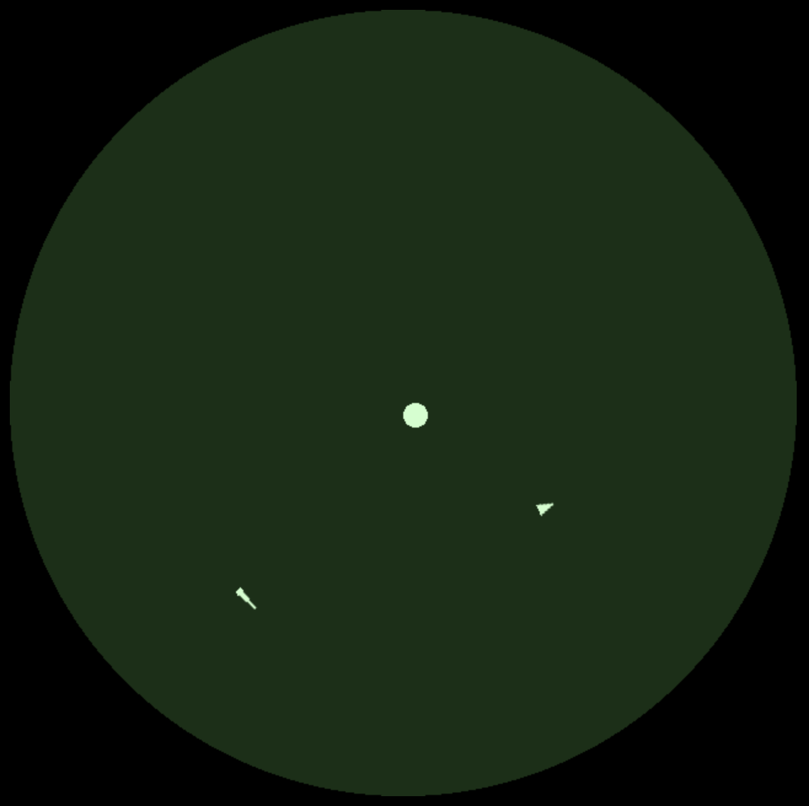

## What's next

So the plan now is to add a few finishing touches to Spacewar! and then release it on Itch.io. Here's the plan:

- Change the look of one of the ships (find out what the Needle ship looks like)
- Add the chaos button
- Trails and starry background for flare
- Publish the game

## Finding out what the Needle looks like

So, our game so far has 2 ships (one controlled by wasd, and one by the arrow keys), but I've made them both triangles since I've been basing the look of this one one blurry cool looking picture:



And since one of the ships is called the Wedge, I assumed it was just a triangle... But no! Turns out this thing had sick graphics: 



However, I've honestly come to love the look of my interpretation of the wedge, I think the simplicity of it just being a triangle adds some charm to it. So now I have to design something that could represent the needle.

Okay maybe design is a big word for what I ended up with, but allow me to present to you:

<h1 style="text-align: center;"> The Needle </h1>

## The chaos button

Now it's time to add the last feature to this game, a hyperspace button that will move a player to a random position on the screen. However, when using it it has a small chance that it will blow up your ship. Fun!
First I'll change the inputs to use "wasdq" instead of "wasd and the spacebar", and "ijklu" instead of "arrows and shift". This will allow me to use the "e" and "o" for the new button. 

So first the functionality is basically to transport the ship to a random point on the map. All this really is, is finding a random point in a circle, which is again just a math problem. 
I found the answer by using this https://stackoverflow.com/a/9879291, changing it a bit so it works for the PixiJS positioning. And then making that radius a random radius between 0 and 320, which is the total radius of the circle.

    function hyperspace(ship){
        var randomAngle = Math.random()*Math.PI*2;
        ship.x = (Math.cos(randomAngle)*(Math.random() * 320)) + 320;
        ship.y = (Math.sin(randomAngle)*(Math.random() * 320)) + 320;
    }

Next up is having a random chance that the ship will explode when using this. Here's what I ended up with, not the best, but not terrible:

    function hyperspace(ship){
        const explodeNumber = Math.random();
        if(ship.explosionChance > explodeNumber){
            app.stage.removeChild(ship);
            return false;
        } else{
            var randomAngle = Math.random()*Math.PI*2;
            ship.x = (Math.cos(randomAngle)*(Math.random() * 320)) + 320;
            ship.y = (Math.sin(randomAngle)*(Math.random() * 320)) + 320;
            return true;
        }
    }

## Flair!

Pazzaz! Hurrah! This is just for fun, adding some stars in the background, and trails following the ships and bullets. 

Okay, so the stars are easy to add, they're just sprites, a bunch of them, very small in the same color as the big star in the middle. However, a trail was one of the hardest things to add. I could probably add it as particles, but it's been difficult (I had major trouble adding the particle system stuff from PixiJS, the suggested thing to do trails without it is to do rope physics stuff?). This chapter was supposed to be fun, not another technical challenge so I'm going to postpone the trails and maybe do that later, or not, who knows. Currently the flair is just the stars in the background. 

## Slap it on Itch.io

Bam, it's just there, it's currently out into the world. It's not really done, but it's playable and I noticed I was sort of dreading continuing with it for some weird reason. 

<iframe frameborder="0" src="https://itch.io/embed/1886317" width="552" height="167"><a href="https://softwaretrinkets.itch.io/spacewar">Spacewar! by SoftwareTrinkets</a></iframe>

Still though, I'm very proud of it! A very bare bones type of game with basically everything made from scratch. Cool stuff. You can find the source-code here if you want to add stuff, or just look around: https://github.com/SoftwareTrinkets/games-in-progress/blob/main/spacewar/index.html 
