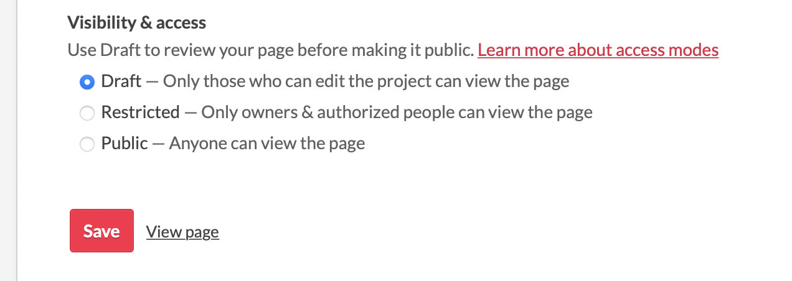

## Introduction

In the [last post](../babylonjs) I've made a small game, but what use is a game if no-one can play it? So in this post I'm going to document how to publish something like this. I've never done that before with BabylonJS, so we're going to find out how that'll work. I have the following rough plan:
- generate a new babylon project on my local machine
- have it 'build' a html page??
- upload that to Itch.io
But we'll see what actually happens.

## Immediately adding to the scope of the game
So something that bugged me while showing my game to other is that I can run it on my phone, but I can't interact with it. It's such a small thing to fix, so I'll just quickly add that. 
Here's what I added to make it work: 

    scene.onPointerObservable.add((pointerInfo) => {
      if (pointerInfo.type === BABYLON.PointerEventTypes.POINTERTAP) {
          if (pointerInfo.event.offsetX / canvas.width < (1/3)) {
              if(score < 50){
              BABYLON.Animation.CreateAndStartAnimation("boxmove", box, "position.x", 60, 5, box.position.x, -2, 0);
              } else{
                  box.position.x = -2
              }
          } else if (pointerInfo.event.offsetX / canvas.width > (1/3) && pointerInfo.event.offsetX / canvas.width < (2/3)){
              if(score < 50){
              BABYLON.Animation.CreateAndStartAnimation("boxmove", box, "position.x", 60, 5, box.position.x, 0, 0);
              } else{
              box.position.x = 0
          }
          }else if (pointerInfo.event.offsetX / canvas.width > (2/3)){
              if(score < 50){
              BABYLON.Animation.CreateAndStartAnimation("boxmove", box, "position.x", 60, 5, box.position.x, 2, 0);
              } else{
                  box.position.x = 2
              }
          }
      }
    });

[Playground](https://playground.babylonjs.com/#DSH9NF#9)

## Back to business

Okay, no more scope changes, for real this time. Let's create a local version of the game. After working with React and React Native for a while, I immediately went looking for a whole project with dependencies etc. But all you really need is an HTML file and you're good to go. I found a great template here: https://doc.babylonjs.com/setup/starterHTML#minimal-html-template

This also has the `createScene()` function that we've been working with in the playground. So we can almost drag and drop that in. I just had to add a reference to the BabylonJS GUI library:

    

You can find the whole HTML file here: https://github.com/SoftwareTrinkets/cube-run/blob/main/web/index.html

If you open this file in the browser you can immediately play it, no server needed. Wild! This seems very obvious now, but when you're so used to working with all these frameworks it's easy to get into the mindset of having to set up a whole project and running a server etc. 
Anyway, now that we have this HTML file, we can just upload that to [itch.io](www.itch.io). If you've never heard of this, itch.io is a very fun website that makes it easy to upload games. Browser games or ones that run on desktop, it hosts it all. 
To upload a game to itch.io you first need to make an account there (through the `Register` button on the homepage). When making my account I ticked the box that said `I'm interested in distributing content on itch.io`. 

Once you've done that, you can go to **Dashboard** at the top and on the **Creator Dashboard** select **Create new project**

It's really up to you what you want to add here, but it really speaks for itself once you're here. 
Once you've got the description, cover image and tags how you like them, you can publish it by setting the project to **Public** here:

And *badabing* **badabang** we've got a published game! You can play Cube Run here: 

<iframe frameborder="0" src="https://itch.io/embed/1855761" width="552" height="167"><a href="https://softwaretrinkets.itch.io/cube-run">Cube Run by SoftwareTrinkets</a></iframe>