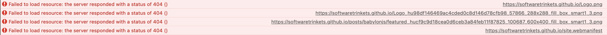
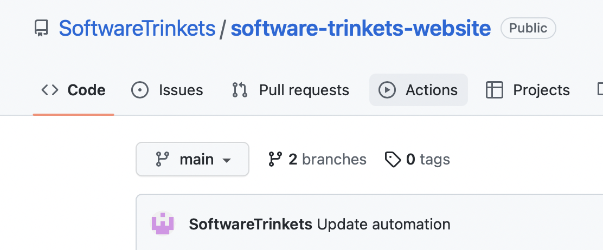
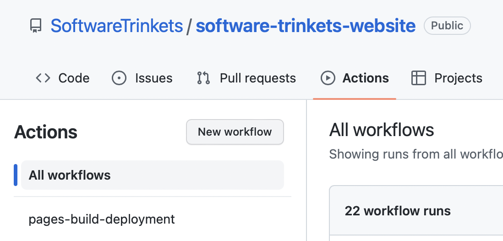
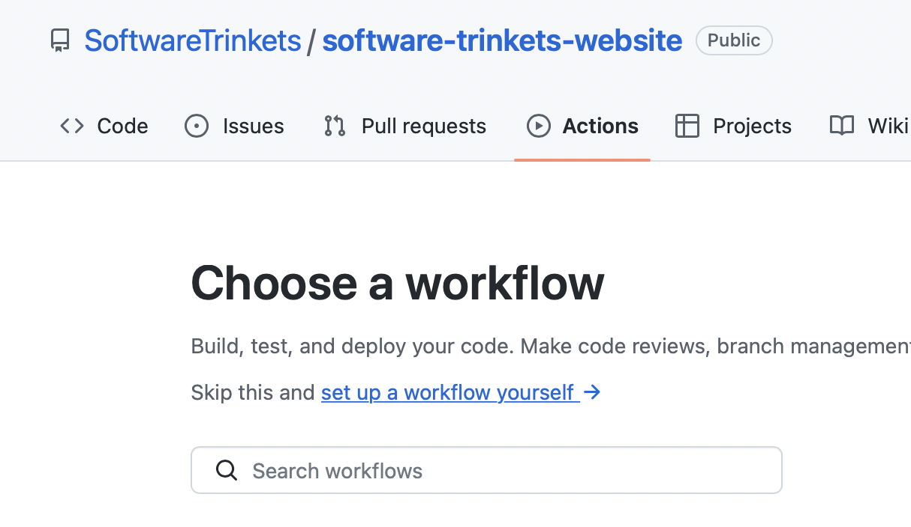
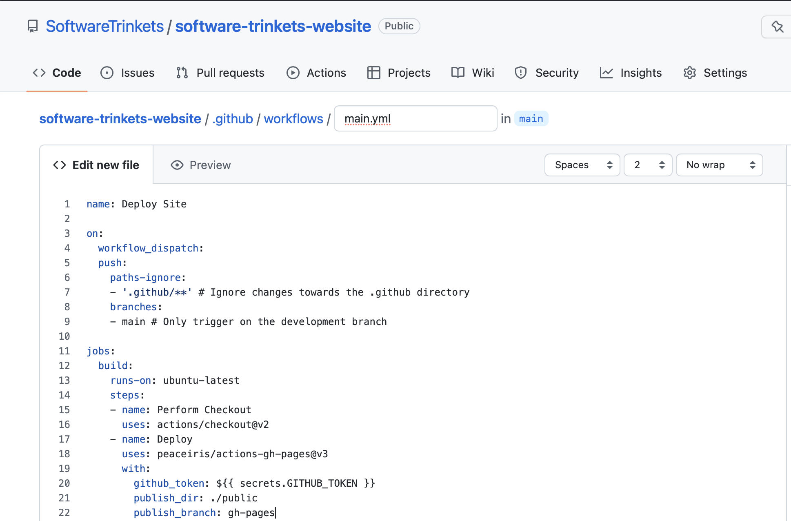
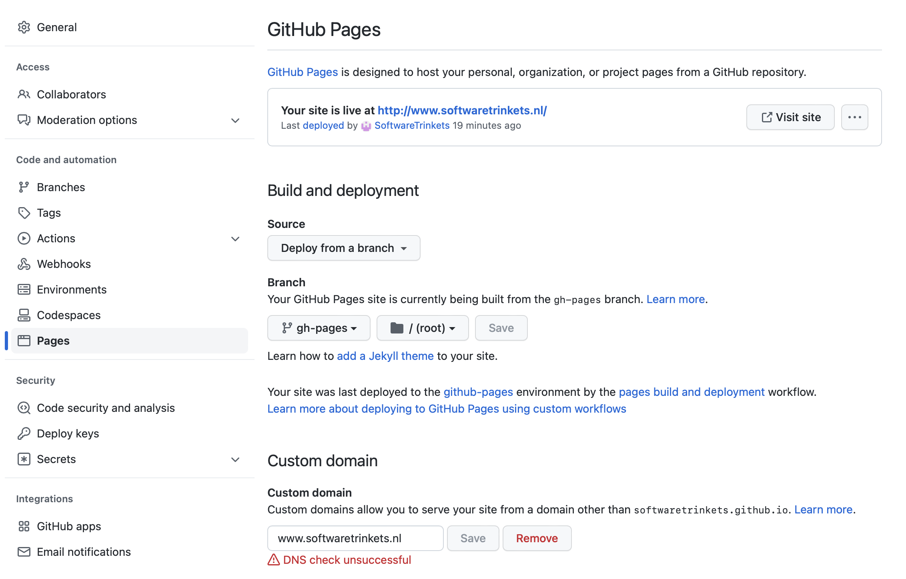
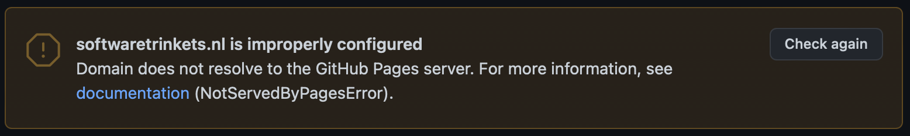

After creating this site I've been changing what I want it to look like, created a logo, finished a second post so it wouldn't be that empty when I launched it. After all that procrastination was done it was time to get it online. 
This turned out to be a little more tricky than I anticipated, so it seemed like a perfect thing to write another blog post about. In this post I'll document:
- How I went from a local running Hugo generated website to hosting it through GitHub Pages.
- Creating the automation to build it all through GitHub instead of locally.
- Setting it up through my custom domain. 

## The reality

I've never registered a domain name before, I know, embarrassing. Better late than never though, but it was still a bit daunting. Apparently you can't just google or check the domains, just in case something is watching for that and getting it before you can. So you have to do a terminal check for the domain you want, see if it returns anything. 
`nslookup www.yourdomain.something`
After checking that the domain was still available I went to the organization that manages names in the Netherlands. https://www.sidn.nl. I'm going for a .nl domain, since that's very cheap and good enough for my purposes. The first year of this domain will cost me roughly 1 Euro, hard to beat that kind of price. After that it's about 10 Euro. 
Something that's also good to keep in mind, there's cheap options where you get both hosting and they'll get a domain name for you. However, after that you don't own the domain name, and if you want to switch to another service you're basically out of luck. So you need a [registrar](https://en.wikipedia.org/wiki/Domain_name_registrar) to manage all that yourself. 

## Getting the site on GitHub Pages

After getting the domain, I thought something low-stakes would be to get the site on 'GitHub Pages' page first. 
Getting a page on [GitHub pages](https://pages.github.com) is actually pretty easy. Once you have the website committed to GitHub you can go into settings and set a branch to go to the 'GitHub Pages' page. 

Running `hugo` in your project folder will generate your static website in the `public` folder. You can then put this on a separate branch and set the GitHub Pages settings to start there. 

HOWEVER

After putting the generated site on the separate branch I thought this would be it, set it and forget it. But nothing worked, I only saw raw HTML and a bunch of 404's. I could see the files in the branch, but they couldn't be found for some reason. 

## Set the baseURL in the config.toml

I didn't really understand what this setting was for when I was building the website, but I've found out the hard way. If the baseURL isn't set to the url that the website is on, it will not work. It will only show you some static html and nothing else. 
For GitHub Pages you need both the domain and the repo name, so in my case that is:
    
    baseURL = "https://softwaretrinkets.github.io/software-trinkets-website/"

After I got that right, I was able to see the site correctly. I did get into trouble with my themes folder disappearing when I switched to put a new version on the gh-pages branch. Which leads us directly to the next point.

## Automating 

I honestly feel like I can't be seen with a website that requires me to manually move a folder to a branch, that just doesn't feel right. So I moved straight on to automation, there already is some automation in the project which was generated for the GitHub Pages. 
Deployment seems like too big a word for copying over a folder from the main branch to the gh-pages branch, but it seems like exactly the kind of thing that's kind of tricky to do manually but super easy to do with automation. 

I found this thread: 
https://github.com/actions/checkout/discussions/405

Which is discussing the exact thing I want to do here. In case this is the first time you're dealing with automation, here's what you do. First, go to the Actions tab in GitHub:

On this page, you can create a new workflow by clicking **New workflow**

Next, select **set up a workflow yourself**, this will create a `main.yml` for your automation

In this file, put I just put the automation from the [GitHub Actions thread](https://github.com/actions/checkout/discussions/405).

    name: Deploy Site

    on:
    workflow_dispatch:
    push:
        paths-ignore:
        - '.github/**' # Ignore changes towards the .github directory
        branches:
        - main # Only trigger on the development branch

    jobs:
    build:
        runs-on: ubuntu-latest
        steps:
        - name: Perform Checkout
        uses: actions/checkout@v2
        - name: Deploy
        uses: peaceiris/actions-gh-pages@v3
        with:
            github_token: ${{ secrets.GITHUB_TOKEN }}
            publish_dir: ./public
            publish_branch: gh-pages

After committing this straight to `main`, we're all ready to run it! This automation should copy the `public` folder (`publish_dir: ./public`), which will then trigger the earlier GitHub Pages automation which serves everything to the https://softwaretrinkets.github.io/software-trinkets-website/ site

For me, this worked, huzzah! Now I only have to run `hugo` locally and push the changes to main for it to automatically pick them up and deploy them through the gh-pages branch.
But we can take it further than this... Wouldn't it be more impressive if we didn't even have to run `hugo` locally?

Since Hugo is a pretty big static site generation framework, someone already made a GitHub action for this! [Look at it!](https://github.com/marketplace/actions/hugo-setup) So next we can basically copy this and use it for our own automation. I only needed minor changes to make it do what I needed it to do. I updated the Hugo version to the one I was using locally, and added `publish_branch: gh-pages` at the bottom to make the changes go to that branch specifically:

    name: Run Hugo and deploy to branch

    on:
    workflow_dispatch:
    push:
        paths-ignore:
        - '.github/**' # Ignore changes towards the .github directory
        branches:
        - main # Only trigger on the development branch

    jobs:
    deploy:
        runs-on: ubuntu-22.04
        concurrency:
        group: ${{ github.workflow }}-${{ github.ref }}
        steps:
        - uses: actions/checkout@v3
            with:
            submodules: true  # Fetch Hugo themes (true OR recursive)
            fetch-depth: 0    # Fetch all history for .GitInfo and .Lastmod

        - name: Setup Hugo
            uses: peaceiris/actions-hugo@v2
            with:
            hugo-version: '0.108.0'
            # extended: true

        - name: Build
            run: hugo --minify

        - name: Deploy
            uses: peaceiris/actions-gh-pages@v3
            if: ${{ github.ref == 'refs/heads/main' }}
            with:
            github_token: ${{ secrets.GITHUB_TOKEN }}
            publish_dir: ./public
            publish_branch: gh-pages

And **BAM**, now I only have to push my content to the repo, and it will automatically build a new website, and deploy it to GitHub Pages. Even though it wasn't that much work to set up this automation, it'll save me so much time now that I don't have to copy over the public folder to a branch myself. With the added benefit that I don't even have to build locally anymore. 

## Configuring my own domain

The last step is to connect the site hosted on GitHub to my custom domain (www.softwaretrinkets.nl), I first set this in the settings of my repo:

After which I followed [this guide](https://docs.github.com/en/pages/configuring-a-custom-domain-for-your-github-pages-site/managing-a-custom-domain-for-your-github-pages-site) on how to set up my DNS settings. 
Changing something about DNS settings is going to take a while to take effect, so after I added the CNAME to a template in the DNS settings I basically had to hope I did it right and wait for up to 24 hours. 
If you did it right, you should see the CNAME added when you run:

    dig www.yourdomain.something +nostats +nocomments +nocmd

After about 5 hours, it updated and I had a bit of a confusing time figuring out if I had done it correctly. Since GitHub kept hitting me with the following message:

GitHub also removed the url from its field when I came back to it again. However, after going to the url a few times, I could see that something was being hosted there. 
I guess this just takes a while, after changing the `baseURL` again in the config.toml to my custom domain everything showed up as it should. 
