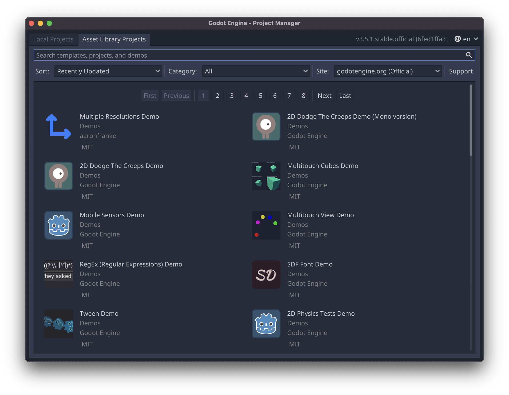
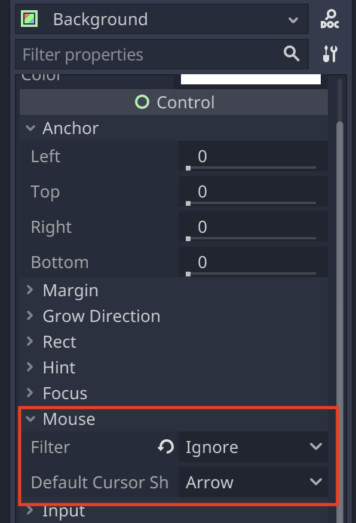

## Intro

So I've been thinking about creating a game where you're repairing stuff for people, and just helping them out. I'm not sure if this is an international thing, but in the Netherlands we have these Repair cafe's. They're a gathering of people, either in a cafe or other place, where there's people who will repair your stuff. You give them your broken device, and they'll attempt to fix it. 
I think this is such a great concept, and an amazing concept for a chill puzzle game. 

## The full plan

My plan for this is to be a chill game, so I also plan to make developing it chill. So this is the plan:

1. Find a framework to create this in (PixiJS/BabylonJS/Unity3D/Something else?)
1. Create satisfying puzzle snapping mechanic
1. Create the pieces of a full puzzle (probably a 3D model, but maybe something else)
1. Create a gameloop
1. Add some story (probably minimal)

## Finding a framework

For this, I need a framework that is a bit more like a game engine than PixiJS is. I could make this in Unity, but it would not be that big a challenge. And to be a bit utilitarian, I found out that Unity doesn't run natively on Mac ARM chips. I've been making all these projects on my couch with a fan-less Macbook Air... I would like it to be at least a bit energy efficient and it would be great if I don't have to install the Rosetta layer.  
Unreal seems a bit overkill for this, I would use Unreal for visually stunning stuff, which this simple puzzle game just isn't going to be. 

### Enter: Godot

Godot is interesting, it's an open-source game engine that does get mentioned in the same breath as Unity and Unreal. I don't think it's anywhere near as feature complete as either of those two, but seeing that it's [open-source and free to use](https://docs.godotengine.org/en/latest/about/faq.html#what-can-i-do-with-godot-how-much-does-it-cost-what-are-the-license-terms) it just has more going for it. Unity has been a money grabby kind of company for a long time now and that just kind of makes you want to avoid working with it. 

### Godot: GDScript...

Okay, so we're all on the same page, we love Godot. And I really did, until I was prompted with the choice. Did I want 'normal' Godot, or Godot with Mono to have C# for scripting...
A question of conscience, do I want to go for the known path that will probably be less efficient (C#)? Or do I want to do this right, and go for the option Godot wants me to take.

But this introduced me to GDScript, which I was hoping was some kind of secret JavaScript. But no, it's their own custom thing: https://docs.godotengine.org/en/stable/about/faq.html#doc-faq-what-is-gdscript 

Their reasoning is interesting: 
>    In the early days, the engine used the Lua scripting language. Lua is fast, but creating bindings to an object oriented system (by using fallbacks) was complex and slow and took an enormous amount of code. After some experiments with Python, it also proved difficult to embed.

It's understandable why they did this, I don't doubt that this is going to be faster than anything else but it does mean that when you want to use this, you have to learn a whole new language. Which isn't great. 

Now, to be fair, I could just download the Mono version, or learn C++. Still though, I was hoping for something a little more friendly. Nevertheless, it seems like a Python kind of scripting language. Shouldn't be too bad, right? 

## Godot: First impression

When first opening Godot, the first impression is great. You are immediately prompted with a lot of example projects to look into. Which is a great start for a beginner, and prevents people getting lost in an empty scene when opening the program for the first time. 

This is great, but I wanted to take on the challenge of starting a new project from scratch. I'm writing this now, a week later, and if you're starting up Godot thinking it'll be a good time poking around this engine. You're in for a big ol slap in the face. It might just be me, but I found this engine ruthless. 

## Godot: Second impression

First off, the different elements are a bit confusing. Nodes, Sprites, Area2D, ColorRect? It wasn't very clear to me what was what and what did what. 
What was very convenient though was the ability to drag in images, they're automatically Sprites and get added to your scene. And since Sprites seem to be the backbone of this whole thing, that was honestly good stuff. 

Now, the idea was a puzzle game, so I figured I would start with snapping together sprites as a first mechanic. And boy, this was way more of a struggle than I expected. 
The very first step, was to see if the mouse was over one of my sprites.... And it was just pain. I've found a million ways to do this, but none of them worked. I wanted to stick to GDScript, since it seems like the kind of thing that'll pay off later. But wow, this took some persistence to continue with. 
I had hoped that my dragging and dropping of puzzle pieces was such a basic idea that there would be something for this already. Unfortunately, no such luck. After too many hours of struggling I did manage to get something to work. If you're currently trying to get a similar mouse interaction working in Godot. Mine wasn't working because of the following things:

1. **I had a random component in my scene that was blocking mouse input from coming through.**
1. I didn't have it added to the right component.
1. I didn't know about the signal system in Godot.

Notice the first one in bold, that was the most important thing. For whatever reason, there was a component in my scene that was blocking mouse input from going through to the script I was working in. 

This was set to `Stop` and was ruining my day.

After that was sorted everything started working, my scripts did what they should have. I also found out about [signals in Godot](https://docs.godotengine.org/en/stable/getting_started/step_by_step/signals.html), which is basically event handling. You can have certain events call certain methods in scripts, which is a good time. You can also have that send extra parameters. 

## Godot final impression: Pretty cool

Honestly after I got over that first bump in the road, Godot was pretty cool to work with. Everything in there seems to have a lot of thought put into it. They also seem to not shy away from braking changes? Which is something you don't encounter a lot anymore. 